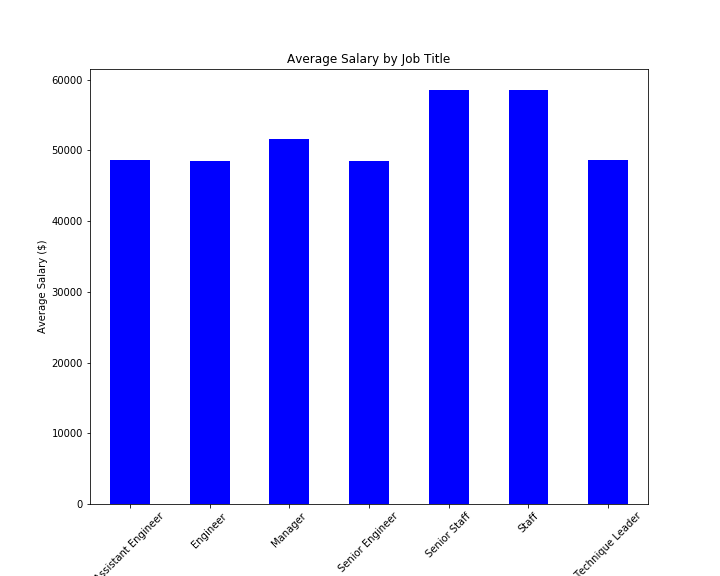

# Employee Database: A Mystery in Two Parts - SQl Challenge

# Background

In this assignment, we will design the tables to hold data in the CSVs, import the CSVs into a SQL database, and write some SQL queries to get answers of some questions about the data. In other words, we will perform:

* Data Engineering
* Data Analysis

# Data Analysis

We will write SQL queries to get the below results:

* List the following details of each employee: employee number, last name, first name, sex, and salary.
* List first name, last name, and hire date for employees who were hired in 1986.
* List the manager of each department with the following information: department number, department name, the manager's employee number, last name, first name.
* List the department of each employee with the following information: employee number, last name, first name, and department name.
* List first name, last name, and sex for employees whose first name is "Hercules" and last names begin with "B."
* List all employees in the Sales department, including their employee number, last name, first name, and department name.
* List all employees in the Sales and Development departments, including their employee number, last name, first name, and department name.
* In descending order, list the frequency count of employee last names, i.e., how many employees share each last name.

While examining the data, I overcome with a creeping suspicion that the dataset is fake. To confirm my hunch, I decided to take the following steps to generate a visualization of the data:

* Imported the SQL database into Pandas.
* Created a histogram to visualize the most common salary ranges for employees.
* Created a bar chart of average salary by title.

# My observations:

As per the above bar chart, we see that the average salary of assistant engineer, engineer, senior engineer and technique leader are almost same which is practically incorrect. The salary of staff and senior staff are almost same and highest among other cadres. The salary of senior staff and staff is more than manager which is totally vague.
